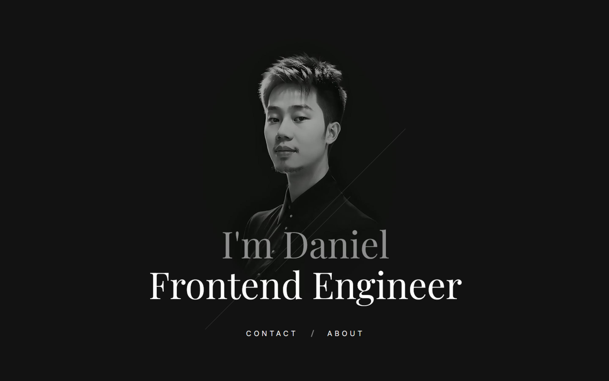

 
 

[Visit my website](https://danielwijaya.com)

 

##

I'm Daniel Wijaya, a Frontend Engineer with a background in UI/UX design. I specialize in bridging design and development to build scalable, user-centered digital products. My work focuses on creating intuitive experiences while delivering clean, maintainable code across modern technologies.

##
Stacks/tools I use:

##
Get in touch:
- Email: wijayadaniel19@gmail.com
- LinkedIn: www.linkedin.com/in/dnlwjy
